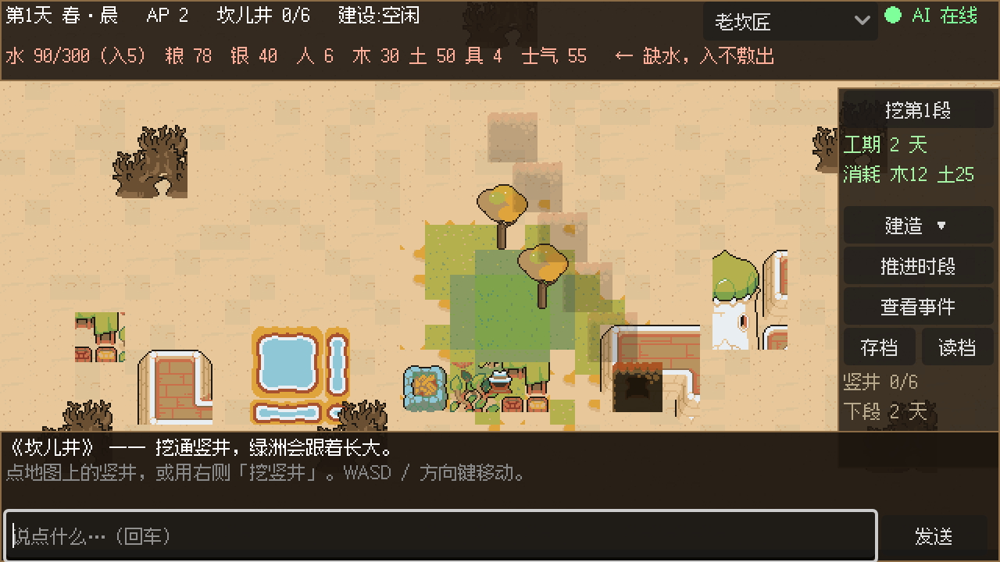
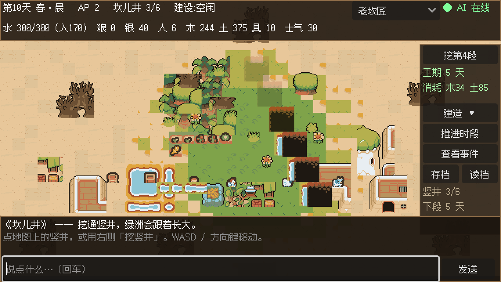

# 《坎儿井》项目工作区

> 从 [游戏设计大纲_坎儿井.md](C:\Users\j\Desktop\游戏设计大纲_坎儿井.md)（GDD v1.0）落地为可运行游戏。
> 项目状态：**S2 治水核心可玩 + S4 角色记忆召回已跑通**
> —— 地图、角色行走、挖竖井、事件抉择、AI 对话收在同一屏，**挖通竖井后绿洲实时变大**（见 `docs/screenshots/`）；
> **角色能复述出上次答应过你的具体细节**（见下文 S4 一节）。
> M1 的 AI 管道保持打通，服务离线时自动降级，除对话外全部功能可用。

---

## 技术架构（已定）

| 层 | 技术 | 职责 |
|---|---|---|
| 表现层 | **Godot 4.7.2（2D）** | 地图、角色、建筑、UI、动画、战斗演出 |
| 状态层 | **Godot GDScript** | 所有精确数值计算（水/粮/繁荣/血量），保证确定性 |
| AI 层 | **Python + FastAPI 旁挂服务** | 调 DeepSeek、维护角色记忆、生成事件与对话 |
| 数据层 | **JSON 配置文件** | 数值表、事件库、角色卡，策划与代码解耦 |

**为什么是"Godot + Python 旁挂"而不是二选一：**
数值计算放 GDScript（零延迟、可回放、可存档），AI 调用放 Python（生态成熟、方便你和 AI 协作调试）。
两者用本机 HTTP 通信（`127.0.0.1:8787`），Godot 侧即使 AI 服务挂了，游戏仍能以降级模式运行——这一点直接决定演示会不会翻车。

```
Godot 客户端  ──HTTP POST──▶  Python AI 服务  ──▶  DeepSeek API
   ▲                                    │
   └────────── JSON: 叙事 + 状态增量 ────┘
```

**关键约定（贯穿全项目，不可违反）：**
1. **LLM 不做精确算术。** 所有数字由本地代码算，模型只输出"叙事文本 + 结构化意图"。
2. **AI 返回必须是可校验的 JSON。** 每个 schema 都有版本号，校验失败走兜底而非崩溃。
3. **AI 服务可以离线。** 无 Key / 无网络时自动降级为本地预设内容（demo 模式），演示不冷场。
4. **前端与后端不共享内存。** 一切通过显式 JSON 协议，方便你分别替换两端。

---

## 目录结构

```
D:\坎儿井\
├── README.md                     ← 你在这
├── progress.md                   ← 任务进度与待办（每次开工先看）
├── .gitignore                    ← 已锁死：.env 永不可提交
├── docs\
│   ├── 00-architecture.md        ← 架构、AI 协议、DeepSeek 接口事实
│   ├── 01-scope-and-order.md     ← 单人无期限下的建设顺序与纪律
│   ├── 03-ai-characters.md       ← 角色人设总览 + 文化审核工作清单
│   └── 04-art-checklist.md       ← 美术资源需求表（含三种方案对比）
├── data\                         ← 数值与内容的唯一真源
│   ├── numbers.json              ← 全系统数值
│   ├── characters.json           ← 7 套角色卡与 system prompt
│   ├── events.v1.json            ← 事件库 64 条
│   └── events.schema.json        ← 事件的 DSL 定义（条件/效果/选项）
├── scripts\                      ← Godot 工程根目录（用 Godot 打开这一层）
│   ├── project.godot
│   ├── core\game_state.gd        ← 权威状态、delta 门禁、挖井/建造、时段推进、存档
│   ├── core\event_system.gd      ← 事件系统：条件 DSL 求值 + 加权抽取 + 效果应用
│   ├── scenes\play.tscn          ← 主场景（run/main_scene）：地图+玩家+HUD+对话+事件
│   ├── scenes\map_view.gd        ← 地图渲染，绿洲半径由 karez.sections 驱动
│   ├── scenes\player.gd          ← 主角四方向行走
│   ├── ui\hud.gd                 ← 资源面板、操作按钮、对话栏、事件弹窗
│   ├── ui\main.gd                ← M1 极简对话台（保留作管道验证，不再是主场景）
│   ├── tests\logic_test.tscn     ← 核心逻辑无头测试（79 项断言）
│   ├── scenes\capture.tscn       ← 一次性截图工具，仅用于验证，不参与正式游戏
│   └── csharp_port\GameState.cs  ← C# 对照端口（纯逻辑库，二选一）
└── ai_backend\                   ← Python AI 旁挂服务
    ├── main.py                   ← FastAPI 服务入口
    ├── ai\client.py              ← DeepSeek 直连封装（含思考模式处置）
    ├── ai\validate.py            ← delta 白名单与夹紧
    ├── ai\characters.py          ← prompt 拼装（静态/动态分层以命中缓存）
    ├── ai\demo.py                ← 离线兜底内容
    ├── schema.json               ← AI 输出的内容契约
    ├── smoke_test.py             ← M1 管道自检（无需 API Key）
    ├── verify.py                 ← 全项目结构与平衡校验（89 项）
    ├── requirements.txt
    └── .env.example              ← 复制为 .env 后填 Key
```

---

## 怎么跑起来

```powershell
# 1) 装依赖（虚拟环境已建好，直接装包）
#    走 pyenv_install 工具，不要直接 pip

# 2) 自检：验证项目结构与数值平衡（不需要 Key，不需要网络）
.venv\Scripts\python.exe ai_backend\verify.py

# 3) 自检：验证 AI 管道逻辑（不需要 Key）
.venv\Scripts\python.exe ai_backend\smoke_test.py

# 4) 自检：验证游戏核心逻辑 —— 挖井流程 / 事件 DSL / 存档回环（79 项断言）
tools\Godot_v4.7.2-stable_win64.exe --headless --path scripts res://tests/logic_test.tscn

# 5) 配置密钥后才接通真实 AI
copy ai_backend\.env.example ai_backend\.env
#    编辑 .env 填入 DEEPSEEK_API_KEY，确认 FORCE_DEMO=0

# 6) 启动 AI 服务
.venv\Scripts\python.exe ai_backend\main.py
#    浏览器打开 http://127.0.0.1:8787/health 确认模式为 live

# 7) 运行游戏
#    Godot 可执行文件就在本仓库内，无需另外安装：
#      tools\Godot_v4.7.2-stable_win64.exe --path scripts
#    或用 Godot 编辑器打开 scripts\project.godot 后按 F5
#
#    操作：WASD / 方向键移动；点地图上的竖井或按右侧「挖竖井」开工；
#          「推进时段」跨过夜晚结算一天；「查看事件」手动触发一条事件；
#          底部输入框可与角色对话（需要 AI 服务）。

# 8) 只想截一张图看画面（不需要人工操作）
#      tools\Godot_v4.7.2-stable_win64.exe --path scripts res://scenes/capture.tscn
#    输出：%APPDATA%\Godot\app_userdata\坎儿井\capture.png
#
#    想同时验证「绿洲随挖井段数生长」，跑这个（会在初始与挖通三段后各截一张）：
#      tools\Godot_v4.7.2-stable_win64.exe --path scripts res://scenes/capture_play.tscn
```

**没配 Key 也能玩。** 未配置或断网时服务自动进入 demo 模式，返回本地预设台词，
游戏不会崩溃——这是刻意的演示容错设计（见 [00-architecture.md](D:\坎儿井\docs\00-architecture.md) 第四节）。

---

## 阶段进度

### S1 / M1 闭环 ✅ 已完成

**跑通"玩家输入 → 调 AI → 拿到 JSON → 状态变化 → 界面显示"。**

- [x] Python 服务能启动，`/health` 返回模型与模式（live / demo）
- [x] `POST /narrate` 发一句玩家输入，返回合法 JSON（含 `narration` + `state_delta`）
- [x] `state_delta` 能真实修改本地水/粮/钱数值（且拦住越权路径与幻觉数值）
- [x] 无 Key / 断网时走 demo 兜底，不崩溃
- [x] Godot 端能发出请求并渲染返回文本 ← **已用项目自带 Godot 4.7.2 实测**
- [x] 拔掉网线后游戏不崩溃 ← **demo 模式已覆盖此路径**

### S2 治水核心 ✅ 已完成

**"能靠治水从『将死』走到『存活』"** —— 这是当前可演示的状态。

- [x] **挖竖井**：点地图上的竖井或按右侧按钮开工，按 `numbers.json` 扣材料与工期
- [x] **水循环**：`日出水 = (段数 × 55 + 旱季残流 5) × 季节融水倍率 + 季节修正`，逐日入账
- [x] **绿洲随段数生长**：`karez.sections` 直接驱动地图绿洲半径，挖通一段绿一圈
- [x] **时段推进**：晨/午/暮/夜四时段，每时段 2 点行动点，跨夜结算一天
- [x] **生存压力**：人口按日耗水耗粮，缺水扣士气，出水不足以养活人口时 HUD 告警
- [x] **事件系统**：64 条事件接入，条件 DSL（gte/lte/eq/neq/has/not_has/is）+ 加权抽取 +
      选项效果应用（含 `flags.*` 布尔赋值与角色记忆写入）
- [x] **存档回环**：状态与事件触发记录一起入库，读档不复位冷却

| 初始（0 段） | 挖通 3 段后 |
|---|---|
|  |  |

> 两张图由 `res://scenes/capture_play.tscn` 自动生成，不是手改的示意图。
> 左图：水 90/300、日入 5 方、已告警「缺水，入不敷出」。
> 右图：第 10 天、坎儿井 3/6、日入 170 方，绿洲明显扩张，农田随之出现。

### S4 AI 角色 —— 部分完成（2026-10-05）

**核心能力已跑通：角色能记住上次答应过什么。**

- [x] 记忆结构化存储（`day` / `text` / `kind` / `imp`），兼容旧存档的纯字符串格式
- [x] **按重要度召回** —— prompt 里一直写着「按重要程度排序」，而此前的实现给的是插入顺序
- [x] **承诺单独成块**喂给模型（混在记忆大列表里容易被忽略）
- [x] 淘汰策略改为「丢最不重要且最旧」，避免珍贵承诺被几十条闲聊挤掉
- [x] **本地兜底**：AI 漏记承诺时由本地补记 —— 实测 `deepseek-flash` 的 `memory_append`
      在 temperature=1.0 下时有时无，而「记住承诺」是 S4 的核心卖点，
      不能托付给模型的自觉（与「LLM 不做精确算术」是同一条纪律）
- [x] 真实 API 联调测试 `ai_backend/live_test.py`（两轮：许承诺 → 回忆承诺）
- [x] Godot 客户端端到端测试 `tests/live_client_test.tscn`
- [ ] 好感度 `affinity` 的读写 —— 数值字段已在，但对话与事件都还没真正影响它

> **实测效果**（`live_client_test.tscn` 输出）：
> 喂入记忆「答应过要修好那把松头的镢头」后问「上次答应你的事还记得吗」，
> 老坎匠答：**「（停下手里的活，斜眼看他）那把镢头。松头的那个。哼，你倒记得。」**
> —— 复述出了具体细节，不是套话。

### 下一步（尚未开始）

- **S3 经营骨架**：建筑系统目前只有 4 种且只做了一半（能建造、能落成、还没接产出）
- **S5 探索 / S6 战斗 / S7 外交**：未开始
- **音频**：188 个音频文件全是 Kenney 通用音效，尚未接入，且题材不符（见 `assets/README.md` 的合规说明）

---

## 验收命令速查

**不需要 Key、不联网：**

```powershell
.venv\Scripts\python.exe ai_backend\verify.py                    # 项目结构与数值   145 项 PASS
.venv\Scripts\python.exe ai_backend\smoke_test.py                # AI 管道自检       44 项通过
tools\Godot_v4.7.2-stable_win64.exe --headless --path scripts res://tests/logic_test.tscn   # 核心逻辑 96 项
```

**需要 Key、会真实调用 DeepSeek（先启动 `ai_backend\main.py`）：**

```powershell
.venv\Scripts\python.exe ai_backend\live_test.py                 # 两轮：许承诺 → 回忆承诺
tools\Godot_v4.7.2-stable_win64.exe --headless --path scripts res://tests/live_client_test.tscn
```

> `live_test.py` 里最关键的一条断言是**「AI 主动把承诺写进 memory_append」** ——
> 这条实测不稳定，所以本地加了兜底；跑不通也不代表游戏坏了，见上文 S4 说明。

> **注意：Godot 可执行文件就在本仓库 `tools\` 内，无需另外安装。**
> 该文件 172 MB，超过 GitHub 单文件上限，因此在 `.gitignore` 里被排除 —— 换机器请另行下载 Godot 4.7.2。
